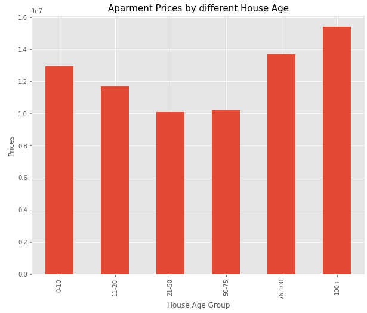
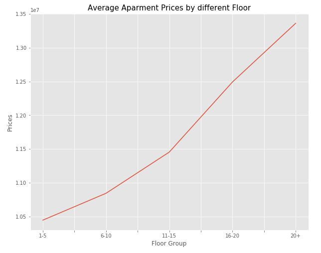
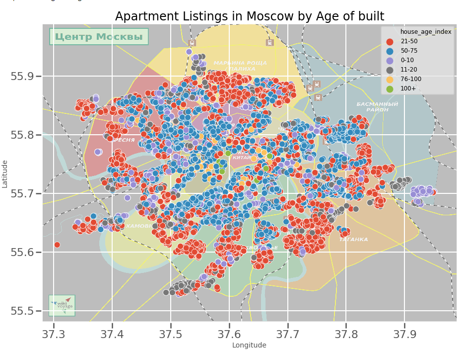
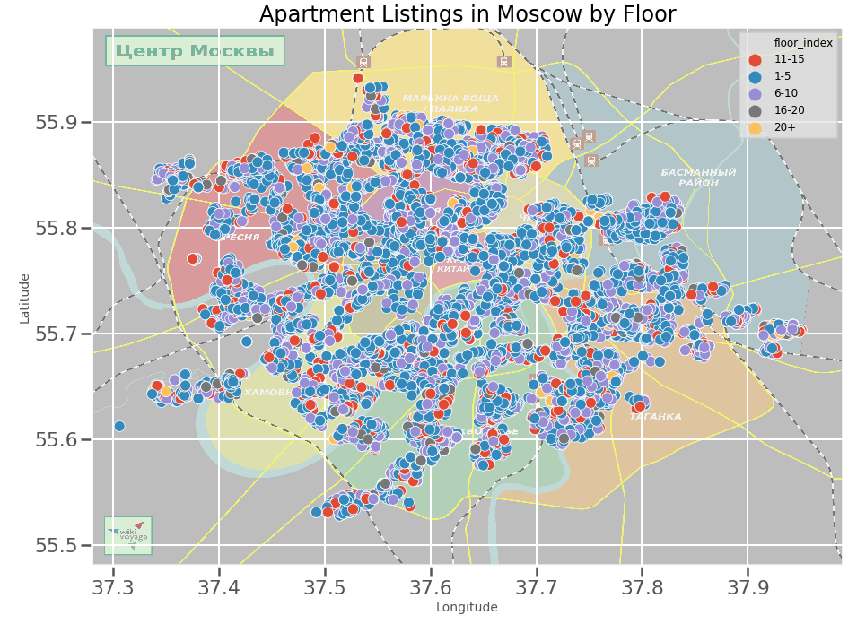

# Moscow Apartment Price Estimator: Data Science end to end Project Overview

Created a tool that estimates moscow apartment prices (MAE ~ $31.8) to help consumers find the best deal.

1 - Carried out EDA on moscow apartment prices and finding key insights.

2.0 - Optimized Linear, Lasso, Decision Tree and Random Forest Regressors using GridsearchCV to reach the best model.

# Code and Resources Used

**Python Version**: 3.7

**Packages**: pandas, numpy, sklearn, matplotlib, seaborn, json, pickle

**Data Resource**: https://www.kaggle.com/alexeyleshchenko/moscow-apartment-listings

# [EDA](https://github.com/Jaspreetsm21/moscow_apartment_prices/blob/main/Data%20Cleaning%20and%20EDA.ipynb)

 

 
